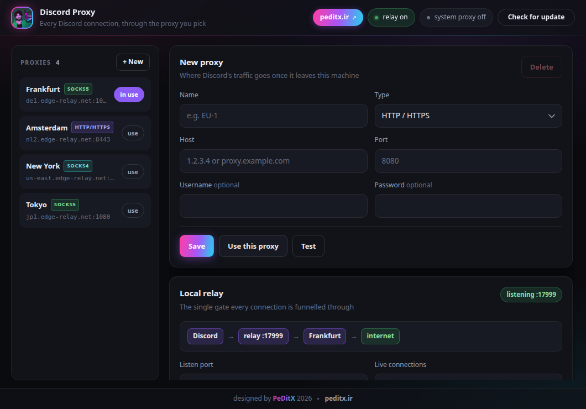

<p align="center">
  
</p>

<h1 align="center">Discord Proxy</h1>

<p align="center">
  <b>Проводите все соединения Discord через прокси, который выберете вы.</b><br>
  Небольшое приложение для Windows на Tauri 2 — HTTP, SOCKS4 и SOCKS5, включая прокси с аутентификацией.
</p>

<p align="center">
  <a href="README.md">English</a> · <a href="readme-fa.md">فارسی</a> · <a href="readme-tr.md">Türkçe</a>
</p>



## Возможности

- Исходящие прокси HTTP / HTTPS, SOCKS5 (имя пользователя и пароль, IPv4 и IPv6) и SOCKS4 / SOCKS4a
- Локальный релей, через который проходят все соединения Discord
- Необязательный системный прокси Windows, который включаете только вы
- Запуск и остановка Discord из приложения — с применением прокси
- Strict mode — по умолчанию выключен
- Живой статус: состояние релей, активный прокси, счётчик соединений
- Сворачивание в трей; в меню трея — Connect / Disconnect / Quit
- Самообновление: проверка новой версии и установка из приложения

## Как это работает

```
Discord ──► 127.0.0.1:17999 (локальный релей) ──► ваш прокси ──► discord.com
```

1. Добавляете прокси и делаете его активным.
2. Запускаете **локальный релей** — HTTP-прокси, слушающий на `127.0.0.1`.
3. Запускаете Discord из приложения (он стартует с `--proxy-server`) либо включаете
   переключатель **Windows system proxy**, чтобы вручную открытый Discord тоже шёл через
   релей.

Релей нужен потому, что Chromium не умеет сам отправлять учётные данные прокси и не
поддерживает аутентифицированный SOCKS5. Релей делает и то и другое и проводит всё через
одни врата.

### Типы прокси

| Тип | Поддержка |
| --- | --- |
| HTTP / HTTPS | туннелирование `CONNECT` с аутентификацией Basic |
| SOCKS5 | имя пользователя / пароль, IPv4 и IPv6 |
| SOCKS4 / SOCKS4a | ✔ |

### Strict mode

По умолчанию выключен. Когда вы запускаете Discord из приложения, флаг передаётся ему:
всё, что не может пройти через прокси, отбрасывается вместо прямого выхода в сеть. Голос
Discord идёт по UDP и при включённом strict mode обычно перестаёт работать — отключите
его, если нужен голос.

## Системный прокси Windows

Переключатель **Windows system proxy** направляет все приложения машины на локальный
релей. Он:

- **никогда не включается сам** — только ваш клик по самому переключателю или по кнопке
  *Start with system proxy* в окне обновления;
- **отклоняется, если Windows использует PAC-скрипт** (`AutoConfigURL`) — в этом случае
  Windows всё равно игнорирует обычный прокси-сервер, поэтому приложение сообщает об ошибке;
- **автоматически восстанавливается** при остановке релей или закрытии приложения, чтобы
  система не осталась с мёртвым прокси.

### Update.exe и сессия обновления

`Update.exe` — программа на .NET, а не Chromium: она читает только собственные настройки
прокси Windows и целиком обошла бы релей. При запуске Discord приложение предлагает
включить системный прокси **только для этого обновления**:

- в окне есть кнопки *OK* (ничего не делать) и *Start with system proxy*;
- после запуска сессия снова выключает системный прокси **через 20 секунд тишины после
  того, как обновляльщик замолкает**;
- если вы уже включили системный прокси сами, предложение не показывается и ничего не
  трогается.

## Самообновление

Кнопка **Check for update** в верхней панели спрашивает GitHub о последнем релизе:

| Надпись | Значение |
| --- | --- |
| Check for update | ещё не проверялось, или проверка не удалась |
| Latest version | это сборка — самая новая |
| Update to vX.Y.Z | доступна более новая версия — по нажатию загружается установщик и приложение перезапускается |

При старте приложение тоже тихо проверяет обновления в фоне; неудача ничего не меняет.

## Установка

Скачайте `Discord.Proxy_<version>_x64-setup.exe` со страницы
[Releases](https://github.com/peditx/discord-proxy/releases) и запустите его. Установщик
сделан на NSIS; обновления, устанавливаемые из приложения, используют тот же файл.

## Настройки

Настройки и сохранённые прокси лежат здесь:

```
%APPDATA%\com.peditx.discordproxy\store.json
```

## Сборка

Приложение собирается **только на GitHub Actions** — см.
[.github/workflows/build.yml](.github/workflows/build.yml). Каждый push в `main` даёт
NSIS-установщик в артефакты; добавление тега (`v1.2.3`) прикрепляет тот же файл и к
релизу.

Локальная сборка (Windows, необязательно):

```bash
cargo tauri build
```

## Разработка

```bash
cargo tauri dev
```

Сборки фронтенда нет — сырой HTML/CSS/JS из [src/](src/) загружается как есть и разговаривает
с Rust-бэкендом через `window.__TAURI__.core.invoke`.

### Структура проекта

```
src/                     интерфейс (без шага сборки)
src-tauri/src/
  lib.rs                 состояние + команды Tauri
  relay.rs               локальный релей (обычный HTTP и CONNECT)
  dial.rs                исходящее соединение: HTTP / SOCKS5 / SOCKS4
  sys.rs                 реестр Windows, поиск/запуск Discord
  store.rs               модели + сохранение в JSON
.github/workflows/
  build.yml              сборка и релиз для Windows
docs/
  screenshot.png         скриншот выше
```

## Авторы

Дизайн: **PeDitX** · [peditx.ir](https://peditx.ir) · 2026
